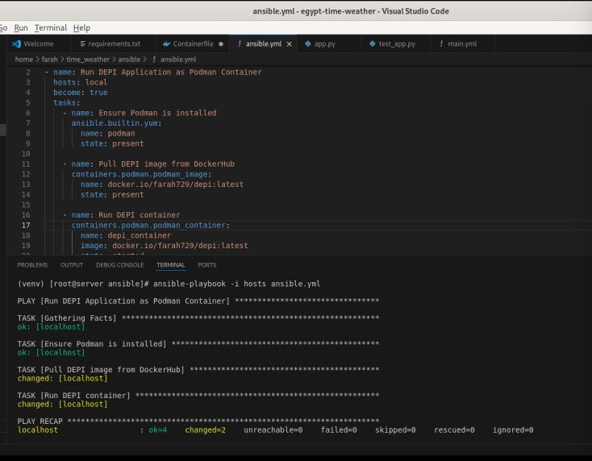

# Flask Web Application

1. **Clone the repository:**

   ```bash
   git clone <repository-url>
   cd <repository-directory>
   ```

2. **Create a virtual environment and activate it:**

   ```bash
   python3 -m venv venv
   source venv/bin/activate  # On Windows use `venv\Scripts\activate.ps1`
   ```

3. **Install the dependencies:**

   ```bash
   pip install -r requirements.txt
   ```

4. **Set up environment variables:** Create a `.env` file in the root directory and add your OpenWeatherMap API key:

   ```bash
   API_KEY=<your_openweathermap_api_key>
   ```
To run the application locally:

```bash
python3 app.py
```

To run the application using Docker:

1. **Build the Docker image:**

   ```bash
   docker build -f Containerfile -t flask-app .
   ```

2. **Run the Docker container:**

   ```bash
   docker run -p 5000:5000 flask-app
   ```

The application will be accessible at [http://127.0.0.1:5000/](http://127.0.0.1:5000/).

## Running Tests

To run the tests and lint the application, use the following commands:

1. **Lint with pylint:**

   ```bash
   pylint app.py
   ```

2. **Run the tests:**

   ```bash
   pytest
   ```

## Project Structure

```
.
├── ansible/                 # Ansible directory
│   ├── ansible.yml          # Ansible playbook file
│   └── hosts                # Inventory file with target hosts
├── app.py                   # Main application file
├── Containerfile            # Dockerfile for building the application image
├── README.md                # Project documentation (this file)
├── requirements.txt         # Project dependencies
├── templates/               # Flask HTML templates
│   ├── index.html
│   └── timer_weather.html
```

## Ansible Deployment

To deploy the application using Ansible:

1. Ensure Ansible is installed on your local machine or deployment server.
2. Update `ansible/ansible.yml` with your deployment tasks.
3. Edit `ansible/hosts` to include the IP addresses or hostnames of your target servers.
4. Run Ansible against your target servers:

   ```bash
   ansible-playbook ansible/ansible.yml -i ansible/hosts
   ```




## Minikube Deployment
To deploy the application using Minikube:

Start Minikube:
 ```bash
minikube start
 ```
Deployment YAML Files
Ensure that your deployment YAML files (e.g., deployment.yml, service.yml, ingress.yml) are correctly configured. If you need to make any changes, apply them using:

 ```bash
# Apply namespace
kubectl apply -f namespace.yml

# Deploy the application
kubectl apply -f deployment.yml

# Create the service
kubectl apply -f service.yml

# Set up ingress
kubectl apply -f ingress.yml

# Apply additional roles
kubectl apply -f role.yml


 ```
## License

This project is licensed under the MIT License. See the LICENSE file for details.

Feel free to contribute to this project by submitting issues or pull requests.
=======
## License
